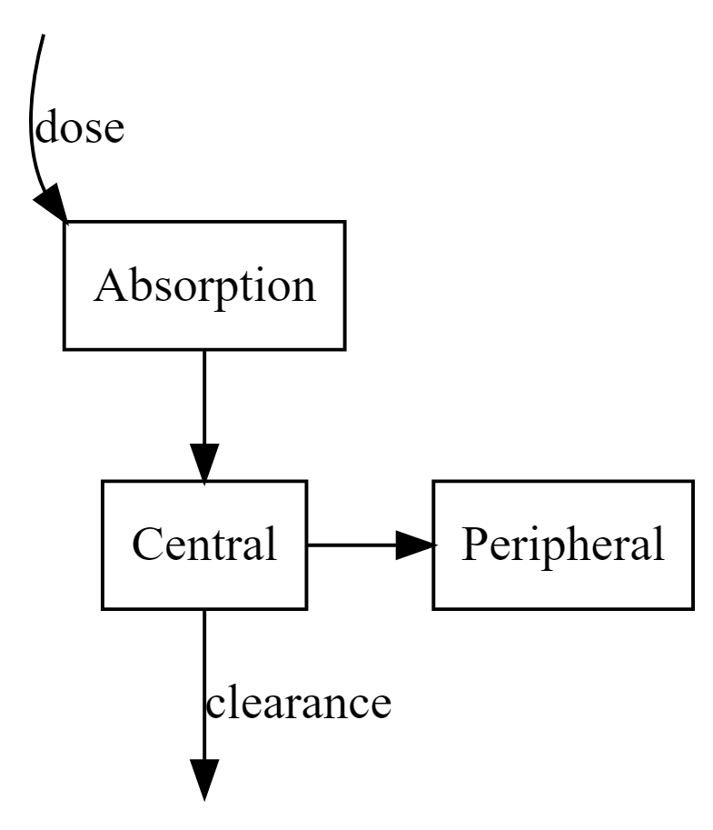
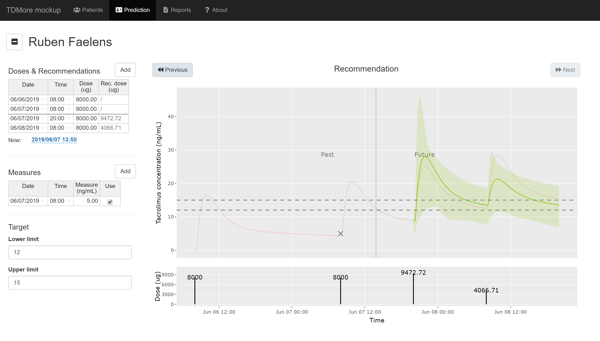

```{r, echo=FALSE, message=FALSE}
library(DiagrammeR)
```

# Introduction and current practice
Tacrolimus is an immuno-suppressor that is used to reduce the risk of graft rejection after solid organ transplant. As with many drugs, it has reduced efficacy at low concentrations, but is potentially toxic at high doses. For tacrolimus, a trough concentration between 10-15ng/mL is targeted during the first 3 months post transplant [@Wallemacq2009].

Unfortunately, tacrolimus pharmacokinetics are widely variable in the population. A standard dose of 5mg/day may result in subtherapeutic concentrations of 2ng/mL for some, and toxic concentrations of 30ng/mL in others. To ensure tacrolimus concentrations stay within the therapeutic window, therapeutic drug monitoring is used. At UZ Leuven, newly transplanted patients undergo daily blood sampling in the morning. The central lab analyzes these samples through LC-MS/MS and reports tacrolimus concentrations to nephrologists by noon. During rounds, the dose is adapted accordingly.

Historically collected data from previous studies [@Vanhove2017BJCP] was analyzed to quantify dose adaptation accuracy and precision. Based on N=315 patients, the number of patients in the target are summarized in the table below. There is only a small amount of patients in the target window. There is very few alarming under-dosing (below 5ng/mL), but at least 1 in 10 patients is overdosed.

----------------------------------------------------------------
 Day after transplant   <5       5-12   12-15   15-20   >20 
---------------------- -------- ------ ------- ------- ---------
          1              0.65     35     16      17       31    

          2              2.6      58     16      13       12    

          3              0.64     50     22      16       11    

          4              0.32     34     29      27       9.4   

          5              0.65     22     33      32       13    

          6               0       15     30      38       17    

          7              0.33     12     27      42       20    

          8               0      7.7     29      40       23    

          9               0      6.5     25      41       27    

          10              0      7.5     22      42       28    

          11              0      5.9     23      44       26    

          12              0      7.1     24      48       21    

          13              0       6      26      49       19    

          14              0      8.6     24      48       19    
----------------------------------------------------------------

# Computer model
The time series of concentrations in an individual patient can be predicted by a computer model. Such a population pharmacokinetic model consists of two parts.

## Structural model
The structural model predicts how concentration evolves over time. This is based on a well-mixed compartment model, where the drug amount flows from the absorption compartment (representing the tacrolimus dose) to the central compartment, further to the deep compartment and also out of the body via elimination.

```{r, echo=FALSE, results='asis', include=FALSE}
DiagrammeR::grViz("
digraph rmarkdown {
  node [shape = box ]
  
  Dose [ label='dose', style=invis ]
  Central [ label='Central' ]
  Peripheral [ label='Peripheral' ]
  Elimination [ label = 'Elim', style = invis ]
  Absorption [ label = 'Absorption' ]
  
  Dose -> Absorption [ arrowType = halfopen, headport=nw, label='dose' ]
  Absorption -> Central
  { rank=same; Central -> Peripheral }
  Central -> Elimination [label='clearance']
}
")
```



This model is implemented as a mathematical system of ordinary differential equations.

$$ \frac{dA0}{dt} = -Ka*A0 $$
$$ \frac{dA1}{dt} = Ka*A0 - Ke*A1 - K12*A1 + K21*A2 $$
$$ \frac{dA2}{dt} = K12*A1 - K21*A2 $$
$$ Ke = CL/V1; K12 = Q/V1; K21=Q/V2 $$
$$ CONC = A1 / V1 $$
This model is determined by several parameters.

----------------------------------------------------------------
$KA$   Absorption rate (/h)
$V1$   Distribution volume of central compartment (L)
$V2$   Distribution volume of peripheral compartment (L)
$Q$    Peripheral clearance (L/h)
$CL$   Elimination clearance (L/h)
----------------------------------------------------------------

## Statistical model
The parameters for the structural model are different for every individual. Based on historic data, the statistical distributions for these parameters can be estimated. They are characterized by the typical value ($\theta$) and the inter-individual variability ($\omega$).

$$ CL = \theta_{CL} * e^{\eta_{CL}} $$
$$ \eta_{CL} \sim \mathcal{N}(0,\omega_{CL})  $$

The model $IPRED$ never fits the observations $Y$ perfectly; this residual error is characterized by a residual error model with variance $\sigma$.

$$ Y = IPRED * (1 + \epsilon) $$
$$ \epsilon \sim \mathcal{N}(0, \sigma) $$

In some cases, the individual parameters are correlated with covariates. For tacrolimus specifically, fast or slow $CYP3A5$ metabolizers have a typical higher or lower clearance. By using these predictive covariates, inter-individual variability can be reduced. The increase in clearance because of CYP3A5 is modeled as $\beta$.

$$ CL = \theta_{CL} * (1 + \beta * CYP3A5) * e^{\eta_{CL}} $$

# Individual dose adaptation
## Empirical Bayesian Estimation
Using the population pharmacokinetic model, concentrations can be predicted for a given set of tacrolimus doses and individual parameters. By tuning the individual parameters, the model prediction is made to fit the observed trough concentrations in the patient.

This is done by using empirical bayesian estimation. This technique maximizes the likelihood of a given set of parameters, determined by:

a) the likelihood of the model (using the candidate parameters) to predict the given concentrations, weighed by the residual error $\sigma$
b) the likelihood of the candidate parameters in the prior population

$$ L = \prod \phi(\eta_i, \theta_i, \omega_i) * \prod \phi(Y_i, IPRED_i, \sigma) $$
$$ \hat{\eta} = \max_\eta log(L) $$

## Model-predictive control
Empirical Bayesian Estimation is challenged when subjects are highly variable. When this variability is not described in the model, the technique assumes the patient is stable.  This may lead to severe prediction errors.

An extension on Emperical Bayesian Adaptation was developed at KULeuven, specifically for highly variable subjects: Model-Predictive Control (MPC). In this technique, the population prior is adapted to the individual subject parameters that were estimated yesterday. This allows the individual estimate to gradually move away from the population typical value.

This technique captures gradual trends in individual parameters, even if they are not described by the original model.

## Technique validation
Both techniques were validated in a prospective evaluation. In this exercise, the historic data is split into "the past" and "the future". The past is used to estimated individual parameters, and the model is then used to predict the immediate future.

Based on this exercise, model-predictive control had superior performance predicting tomorrow. This directly influences the precision and accuracy of dosing advice.

TODO: add simulation results?

## Dose adaptation
Once the individual parameters are identified, the effect of a future dose can be predicted. The dose is adapted to put the predicted concentration on target.

# Software implementation and validation
TODO: Describe software architecture, 

# Integration into clinical workflow
Patients receive a loading dose just before or during the transplant operation. The next morning, a blood sample is taken (between 06:00 and 08:00) and they receive a first maintenance dose (at 08:00).

Covariate information (transplant date, bodyweight, etc) is recorded into the KWS. Administered doses and future planned doses are also registered.

By 12:00, the central laborotory has performed LC/MS-MS on the blood sample to identify whole blood tacrolimus concentration. This is recorded in the KWS.

Once all information is available, this data is automatically transferred to the expert system. The expert system tests whether the information is complete and correct. It then performs an estimation step to identify the most likely individual parameters. For all future planned doses, the software finds the dose that is predicted to hit the target of 13.5 ng/mL at trough.

Finally, this data is sent back to the KWS system. In case future doses were not yet validated by a physician, they are adapted to the software recommended dose. Validated doses are never touched. This system ensures a "physician in the loop", as no computer-recommended dose will ever be administered without explicit physician approval.

When a physician does not agree with the recommended dose, or wants more background information, a link is provided in the KWS to open the TDMore web application. In this interactive application, physicians can verify correct data input, how likely the individual patient parameter are in the prior population, and simulate alternative doses.



# Study endpoint
TODO: Describe primary endpoint and statistical analysis plan

# Study power
TODO: Describe in silico simulation of study power

# References